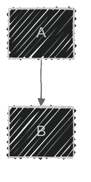
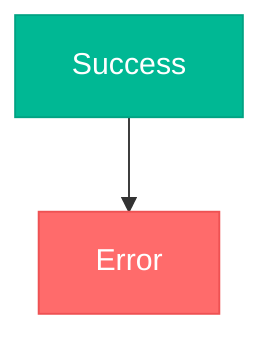

# Advanced Mermaid Features

## Frontmatter Configuration



## Themes

| Theme | Description |
|-------|-------------|
| `default` | Standard blue |
| `forest` | Green earth tones |
| `dark` | Dark mode |
| `neutral` | Grayscale professional |
| `base` | Minimal, best for customization |

## Theme Variables

Key variables for `base` theme customization:

| Variable | Purpose |
|----------|---------|
| `primaryColor` | Main node fill |
| `primaryTextColor` | Text on primary nodes |
| `primaryBorderColor` | Primary node borders |
| `lineColor` | Connection lines |
| `secondaryColor` | Secondary elements |
| `tertiaryColor` | Tertiary elements |
| `background` | Diagram background |
| `mainBkg` | Main background |
| `textColor` | General text |
| `nodeBorder` | Node borders |
| `clusterBkg` | Subgraph background |
| `clusterBorder` | Subgraph borders |

## Layout Options

- `layout: dagre` (default) — classic balanced layout
- `layout: elk` — better for complex diagrams with 20+ nodes

**ELK settings:**
```yaml
config:
  layout: elk
  elk:
    mergeEdges: true
    nodePlacementStrategy: BRANDES_KOEPF
```

ELK strategies: `SIMPLE`, `NETWORK_SIMPLEX`, `LINEAR_SEGMENTS`, `BRANDES_KOEPF` (default)

## Look Options

- `look: classic` — traditional Mermaid
- `look: handDrawn` — sketch-like appearance

## Flowchart Styling

**Class-based:**


**Individual node:** `style A fill:#ff6b6b,stroke:#333,stroke-width:4px`

**Link by index:** `linkStyle 0 stroke:#ff3,stroke-width:4px`

**Subgraph styling:** `style SubgraphName fill:#e3f2fd,stroke:#2196f3,stroke-width:2px`

## SVG Export

```bash
mmdc -i diagram.mmd -o output.svg -w 1920 -H 1080
mmdc -i diagram.mmd -o output.svg -b transparent
```
