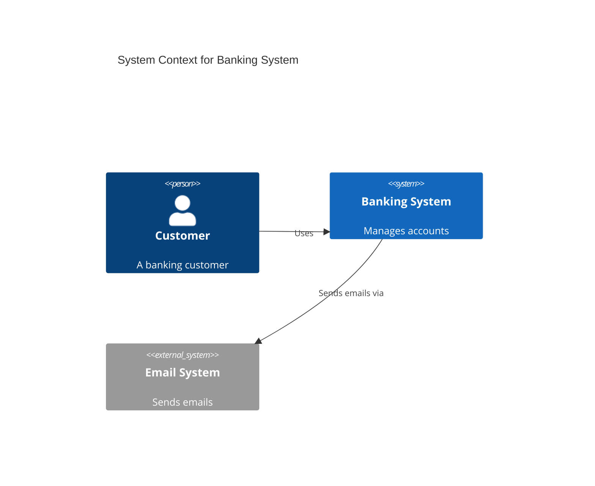
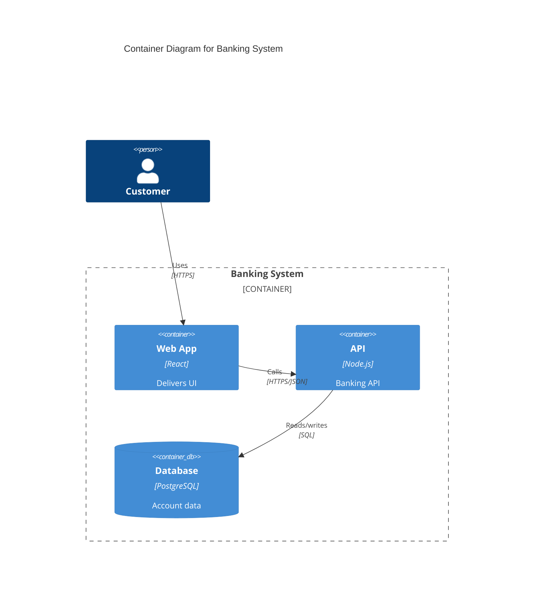
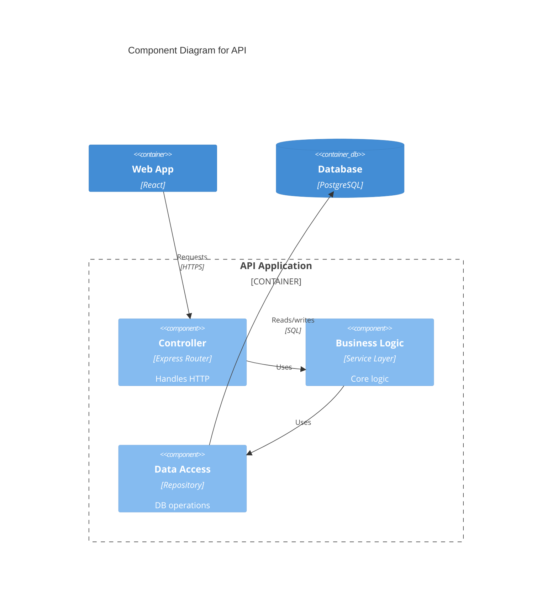

# C4 Model Diagrams

The C4 model visualizes software architecture at four levels: Context, Containers, Components, and Code.

## C4 Context Diagram

Shows your system, its users, and external systems.

### Elements

**People:**
- `Person(id, "Name", "Description")`
- `Person_Ext(id, "Name", "Description")` — external

**Systems:**
- `System(id, "Name", "Description")` — internal
- `System_Ext(id, "Name", "Description")` — external
- `SystemDb(id, "Name", "Description")` — database system
- `SystemQueue(id, "Name", "Description")` — message queue
- Add `_Ext` suffix for external variants of Db/Queue

**Relationships:**
- `Rel(from, to, "Label")`
- `Rel(from, to, "Label", "Technology")`
- `BiRel(a, b, "Label")` — bidirectional

## C4 Container Diagram

Zooms into a system to show applications, databases, and services.

### Elements

- `Container(id, "Name", "Technology", "Description")`
- `ContainerDb(id, "Name", "Technology", "Description")`
- `ContainerQueue(id, "Name", "Technology", "Description")`
- Add `_Ext` for external variants

### Boundaries

## C4 Component Diagram

Zooms into a container to show internal components.

## Layout Hints

- `UpdateRelStyle(from, to, $offsetX="50", $offsetY="-30")` — adjust label positions
- Use `Container_Boundary` to group related containers
- Level 4 (Code) uses regular `classDiagram` syntax
