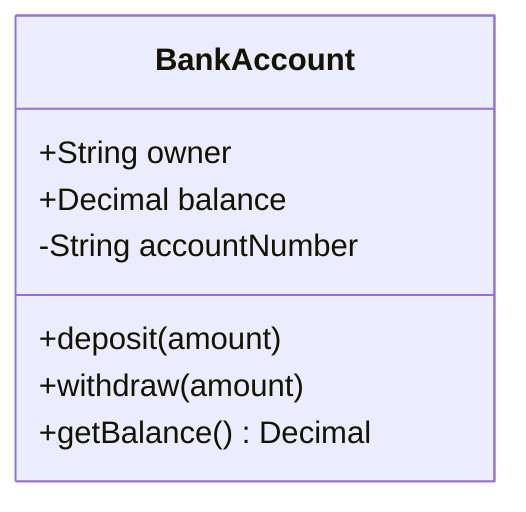
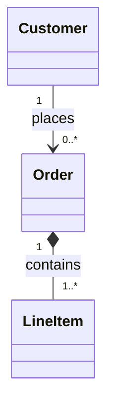
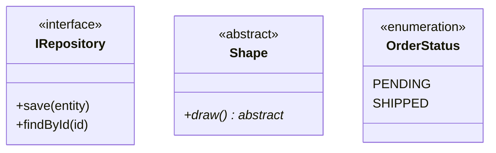
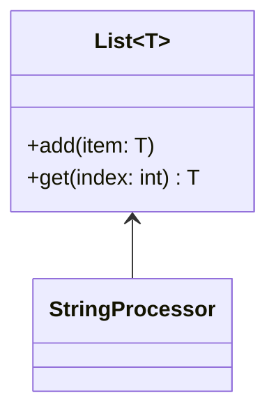
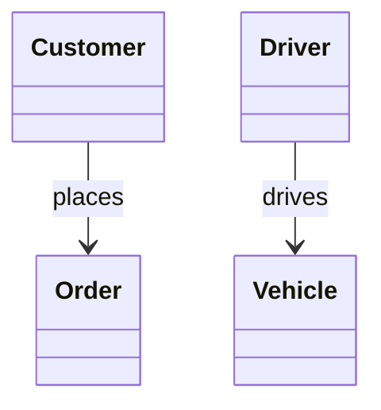

# Class Diagrams

## Defining Classes

**Visibility modifiers:** `+` Public, `-` Private, `#` Protected, `~` Package/Internal

**Member syntax:** `+type attribute` | `+method(params) ReturnType`

## Relationships

| Syntax | Type | Meaning |
|--------|------|---------|
| `A -- B` | Association | Loose relationship, independent |
| `A *-- B` | Composition | Strong ownership, child deleted with parent |
| `A o-- B` | Aggregation | Weak ownership, child exists independently |
| `A <\|-- B` | Inheritance | B extends A |
| `A <.. B` | Dependency | B depends on A (parameter/local) |
| `A <\|.. B` | Realization | B implements interface A |

## Multiplicity

**Values:** `1`, `0..1`, `0..*` or `*`, `1..*`, `m..n`

## Stereotypes and Abstract

Other stereotypes: `<<service>>`, `<<dataclass>>`, `<<entity>>`, `<<value object>>`, `<<aggregate root>>`

## Generic Classes

## Relationship Labels

