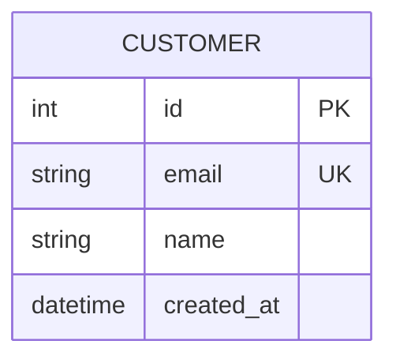
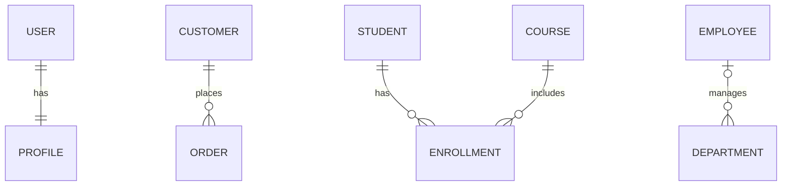
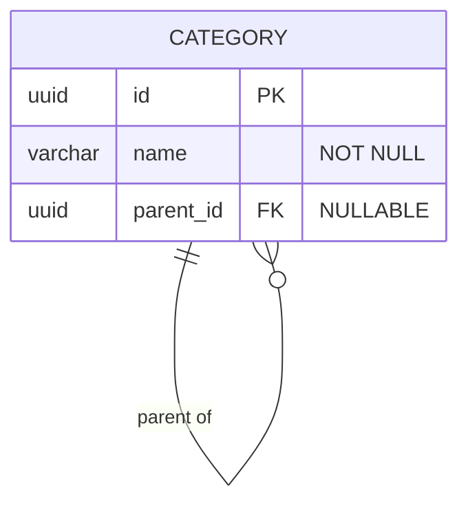
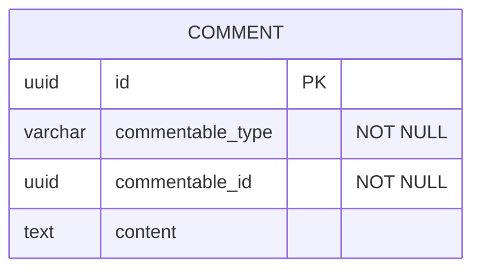

# Entity Relationship Diagrams (ERD)

## Entity Attributes



**Format:** `type name constraints`

**Constraints:** `PK` (Primary Key), `FK` (Foreign Key), `UK` (Unique Key), `NN` (Not Null)

**Attribute comments:** Add in quotes after constraints: `varchar email UK "NOT NULL"`

## Relationship Syntax

**Cardinality indicators:**

| Symbol | Meaning |
|--------|---------|
| `\|\|` | Exactly one |
| `\|o` | Zero or one |
| `}{` | One or many |
| `}o` | Zero or many |

**Line types:** `--` (non-identifying), `..` (identifying)

### Common Relationships



## Data Types

Standard database types: `int`, `bigint`, `varchar`, `text`, `decimal`, `boolean`, `date`, `datetime`, `timestamp`, `json`, `jsonb`, `uuid`, `blob`

## Common Patterns

### Self-Referencing (Hierarchical)



### Junction Table (Many-to-Many)

```mermaid
erDiagram
    STUDENT ||--o{ ENROLLMENT : has
    COURSE ||--o{ ENROLLMENT : includes
    ENROLLMENT {
        uuid student_id FK PK
        uuid course_id FK PK
        date enrolled_date
    }
```

### Polymorphic Relationship


