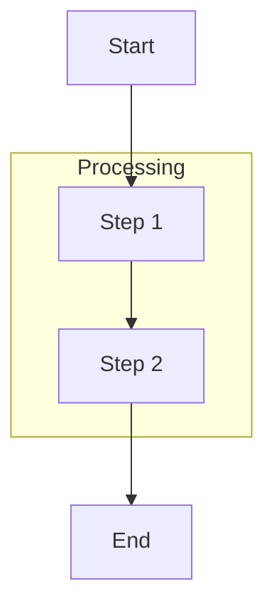

# Flowcharts

## Directions

`TD`/`TB` (Top-Down), `BT` (Bottom-Top), `LR` (Left-Right), `RL` (Right-Left)

## Node Shapes

| Syntax | Shape |
|--------|-------|
| `A[text]` | Rectangle |
| `A([text])` | Stadium/pill (start/end) |
| `A{text}` | Rhombus (decision) |
| `A[(text)]` | Cylinder (database) |
| `A((text))` | Circle |
| `A[[text]]` | Subroutine (double border) |
| `A{{text}}` | Hexagon |
| `A[/text/]` | Parallelogram (I/O) |
| `A[\text\]` | Alt parallelogram |
| `A[/text\]` | Trapezoid |
| `A[\text/]` | Alt trapezoid |
| `A>text]` | Asymmetric/flag |

## Connections

| Syntax | Type |
|--------|------|
| `-->` | Arrow |
| `---` | Open link (no arrow) |
| `-->\|Label\|` | Arrow with label |
| `-.->` | Dotted arrow |
| `==>` | Thick arrow |
| `-.Label.->` | Dotted with label |
| `==Label==>` | Thick with label |

**Chaining:** `A --> B --> C --> D`

**Multi-directional:** `A --> B & C & D` or `B & C --> D`

## Subgraphs



Subgraphs can be nested. Use `direction` inside to override flow direction.

## Styling

**Class-based:**


**Individual node:**
```
style B fill:#ff6b6b,stroke:#333,stroke-width:4px,color:#fff
```

**Link styling (by index):**
```
linkStyle 0 stroke:#ff3,stroke-width:4px
```

## Click Events


