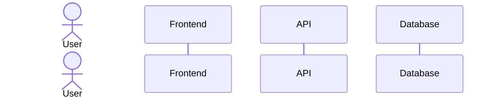
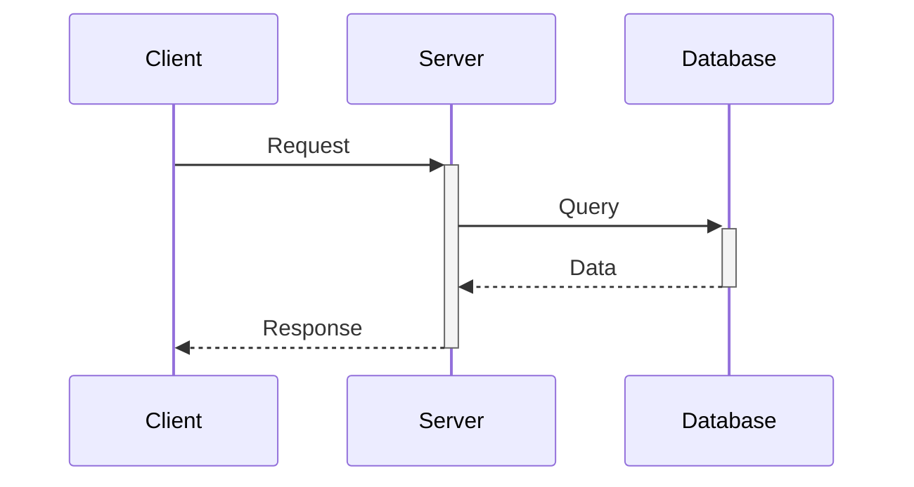
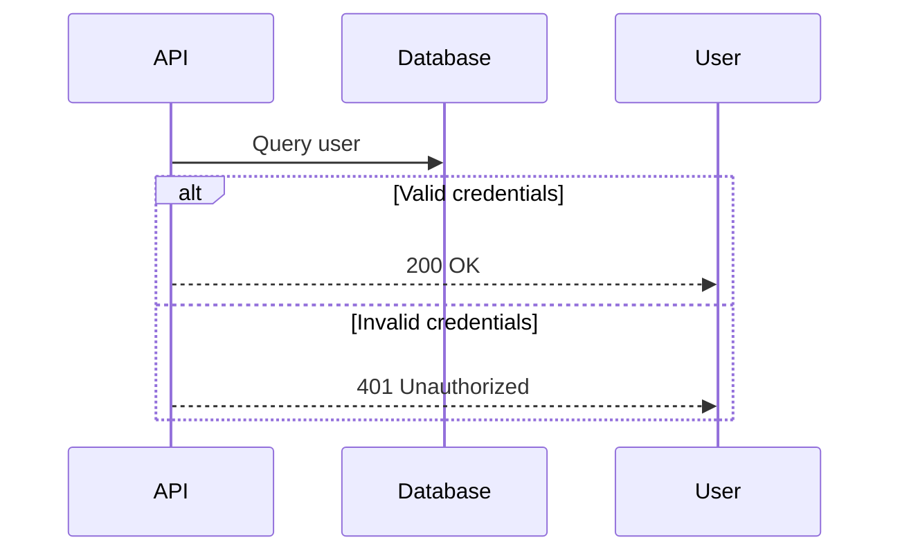
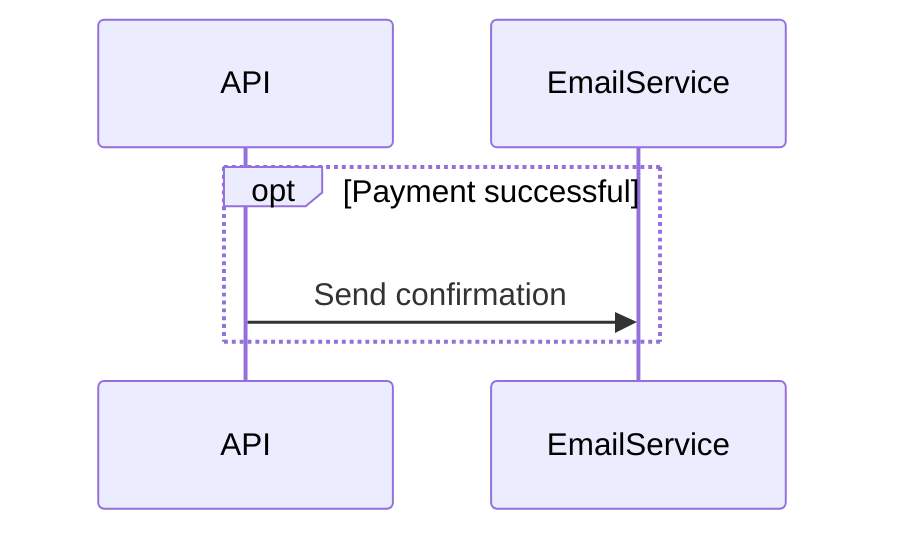
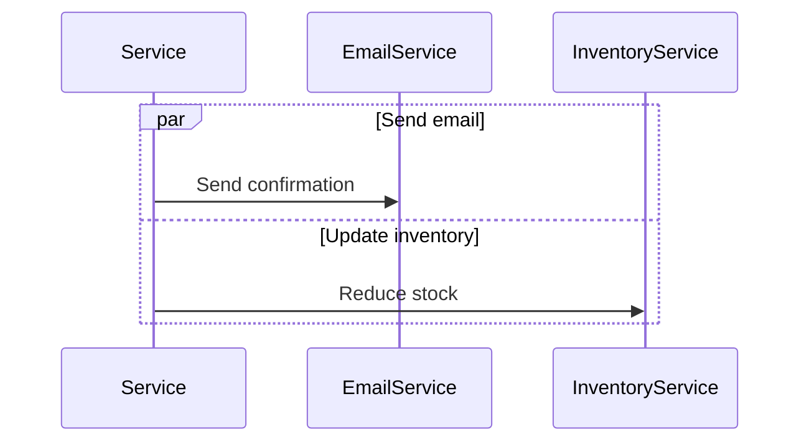
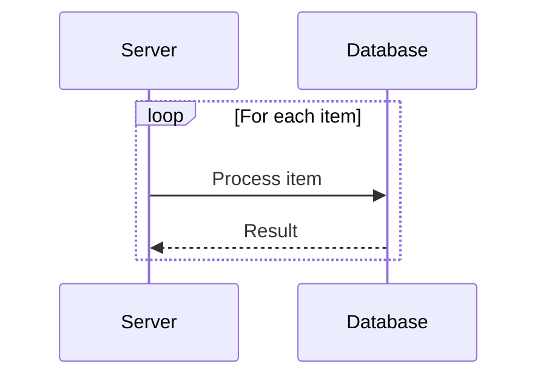
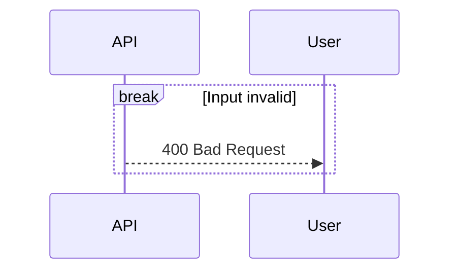
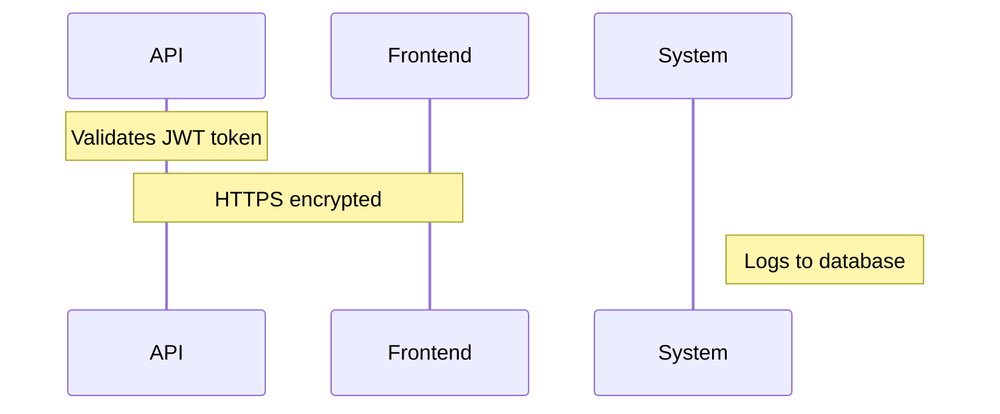
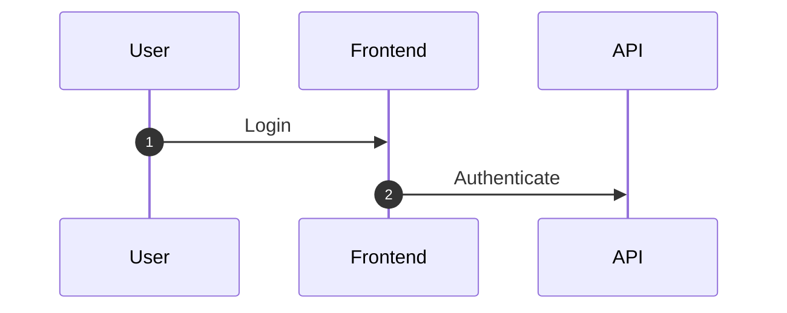
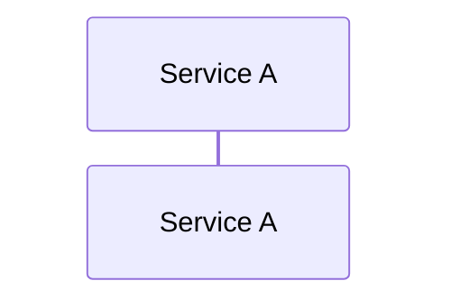

# Sequence Diagrams

## Participants and Actors

- `participant` — system components
- `actor` — external entities (users, external systems)

## Message Types

| Syntax | Meaning |
|--------|---------|
| `->>` | Solid arrow (synchronous request) |
| `-->>` | Dotted arrow (response/return) |
| `-)` | Solid open arrow (async) |
| `--)` | Dotted open arrow (async response) |
| `-x` | Cross/delete |

## Activations

`+` after arrow activates, `-` before arrow deactivates:

## Control Flow Blocks

### alt/else (Conditional)

### opt (Optional)

### par (Parallel)

### loop

### break (Early Exit)

## Notes

## Sequence Numbers

## Links

